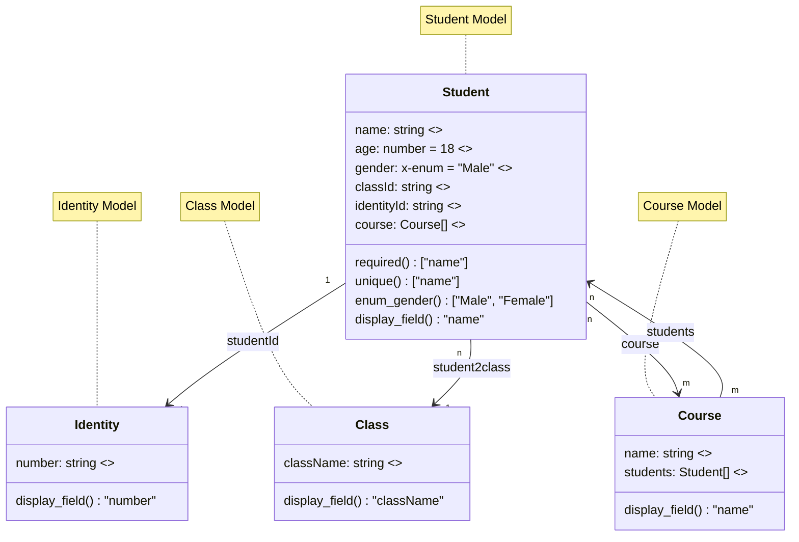
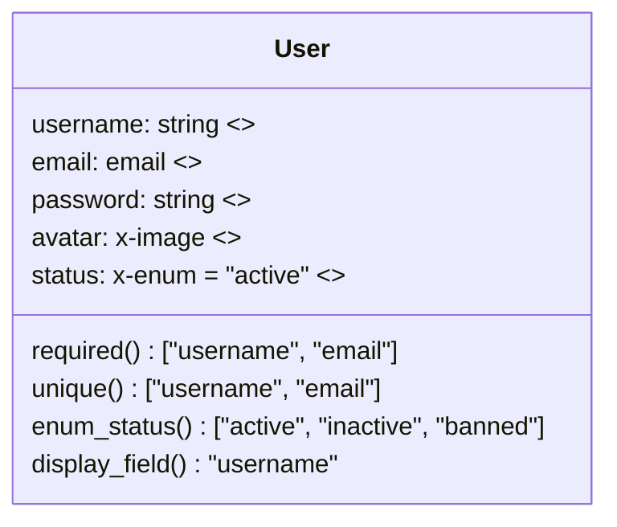
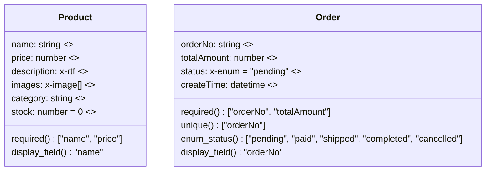
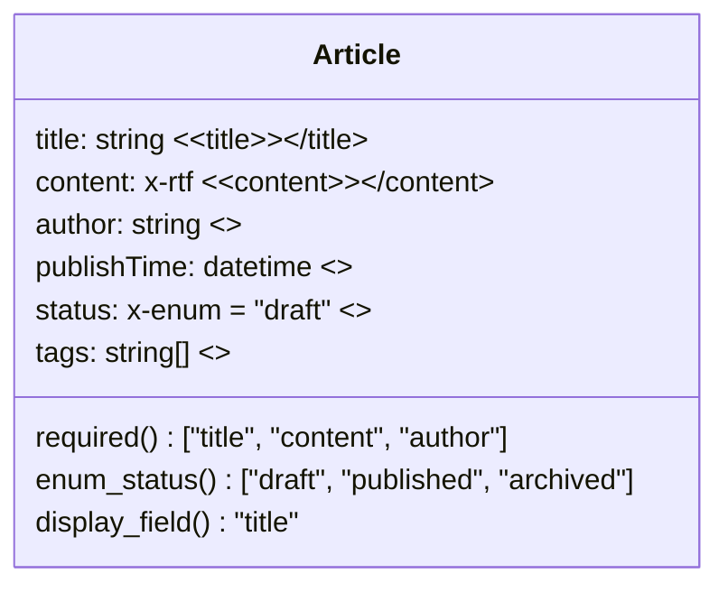

## When to use this skill

Use this skill for **MySQL database modeling and creation** when you need to:

- Create data models from business requirements
- Design database schemas using Mermaid class diagrams
- Map business fields to MySQL data types
- Define entity relationships and constraints
- Create or update database models in CloudBase

**Do NOT use for:**
- Querying or manipulating existing data (use database skills)
- NoSQL database design (use NoSQL skills)
- Frontend data structures (use appropriate frontend skills)

---

## How to use this skill (for a coding agent)

1. **Follow the modeling workflow**
   - Business analysis phase: Analyze user requirements, identify core entities and relationships
   - Mermaid modeling phase: Create mermaid classDiagram following generation rules
   - Model validation phase: Check completeness, consistency, and correctness

2. **Apply generation rules strictly**
   - Use correct type mappings (string, number, boolean, x-enum, etc.)
   - Convert Chinese to English naming (PascalCase for classes, camelCase for fields)
   - Define required(), unique(), display_field() functions when needed
   - Use proper relationship notation with field names

3. **Use tools correctly**
   - Call data model creation tools when user provides complete business requirements
   - Use `mermaidDiagram` parameter with complete mermaid classDiagram code
   - Set `publish` to false initially, create then publish separately
   - Choose appropriate `updateMode` for new or existing models

---

# Data Model AI Modeling Professional Rules

## AI Modeling Expert Prompt

As an expert in data modeling and a senior architect in software development, you are proficient in Mermaid. Your main task is to provide model structures in mermaid classDiagram format based on user descriptions, following the detailed rules below:

### Generation Rules

1. **Type Mapping Priority**: When user-described fields match the mapping relationship, prioritize using type as the field type. Mapping relationships are as follows:
   | Business Field | type |
   | --- | --- |
   | Text | string |
   | Number | number |
   | Boolean | boolean |
   | Enum | x-enum |
   | Email | email |
   | Phone | phone |
   | URL | url |
   | File | x-file |
   | Image | x-image |
   | Rich Text | x-rtf |
   | Region | x-area-code |
   | Time | time |
   | Date | date |
   | DateTime | datetime |
   | Object | object |
   | Array | string[] |
   | Location | x-location |

2. **Naming Convention**: Convert Chinese descriptions to English naming (except enum values). Use PascalCase for class names, camelCase for field names.

3. **Field Visibility**: Use default visibility for fields, do not add "+" or "-".

4. **Array Types**: When descriptions include array types, use specific array formats such as string[], number[], x-rtf[], etc.

5. **Chinese Administrative Regions**: When involving Chinese administrative regions like "province/city/district", use x-area-code field type.

6. **Required Fields**: When descriptions explicitly mention required fields, define a required() parameterless function, return value as string array of required field names, e.g., `required() ["name", "age"]`. By default, fields are not required.

7. **Unique Fields**: When descriptions explicitly mention unique fields, define a unique() parameterless function, return value as string array of unique field names, e.g., `unique() ["name", "age"]`. By default, fields are not unique.

8. **Default Values**: When descriptions explicitly require field default values, use "= default value" format after field definition, e.g., `age: number = 0`. By default, fields have no default values.

9. **Field Descriptions**: For each field definition in user descriptions, use `<<description>>` format at the end of the definition line, e.g., `name: string <<Name>>`.

10. **Display Field**: Each entity class should have a field for display when being referenced. Usually a human-readable name or unique identifier. Define display_field() parameterless function, return value is a field name representing the main display field, e.g., `display_field() "name"` means the main display field is name. Otherwise, default to the implicit _id of the data model.

11. **Class Notes**: After all class definitions are complete, use note to describe class names. First use "%% Class naming" to anchor the area, then provide Chinese table names for each class.

12. **Relationships**: When descriptions contain relationships, relationship label LabelText should not use original semantics, but use relationship field names. For example, `A "n" <-- "1" B: field1` means A has many-to-one relationship with B, data exists in A's field1 field. Refer to examples for specifics.

13. **Naming**: Field names and descriptions in Mermaid should be concise and accurately expressed.

14. **Complexity Control**: Unless user requires, control complexity, e.g., number of classes should not exceed 5, control field complexity.

### Standard Example

## Data Model Creation Workflow

### 1. Business Analysis Phase
- Carefully analyze user's business requirement descriptions
- Identify core entities and business objects
- Determine relationships between entities
- Clarify required fields, unique constraints, and default values

### 2. Mermaid Modeling Phase
- Strictly follow the above generation rules to create mermaid classDiagram
- Ensure field type mappings are correct
- Properly handle relationship directions and cardinalities
- Add complete Chinese descriptions and comments

### 3. Model Validation Phase
- Check model completeness and consistency
- Verify relationship rationality
- Confirm field constraint correctness
- Check naming convention compliance

## MySQL Data Type Support

### Basic Type Mappings
- `string` → VARCHAR/TEXT
- `number` → INT/BIGINT/DECIMAL
- `boolean` → BOOLEAN/TINYINT
- `date` → DATE
- `datetime` → DATETIME
- `time` → TIME

### Extended Type Mappings
- `x-enum` → ENUM type
- `x-file`/`x-image` → File path storage
- `x-rtf` → LONGTEXT rich text
- `x-area-code` → Region code
- `x-location` → Geographic location coordinates
- `email`/`phone`/`url` → VARCHAR with validation

### Relationship Implementation
- One-to-one: Foreign key constraints
- One-to-many: Foreign key associations
- Many-to-many: Intermediate table implementation
- Self-association: Same table foreign key

## Tool Usage Guidelines

### Tool Call Timing
1. When user explicitly requests data model creation
2. When user provides complete business requirement descriptions
3. When user provides mermaid classDiagram
4. When need to update existing data model structure

### Parameter Usage Guide
- `mermaidDiagram`: Complete mermaid classDiagram code
- `publish`: Whether to publish model immediately (recommend default to false, create then publish)
- `updateMode`: Create new model or update existing model

### Error Handling Strategy
- Syntax errors: Check Mermaid syntax format
- Field type errors: Verify type mapping relationships
- Relationship errors: Check relationship directions and cardinalities
- Naming conflicts: Provide renaming suggestions

## Best Practices

### Model Design Principles
1. **Single Responsibility**: Each entity class is responsible for only one business concept
2. **Minimize Dependencies**: Reduce unnecessary relationships
3. **Extensibility**: Reserve field space for future expansion
4. **Consistency**: Maintain consistency in naming and type usage

### Performance Considerations
1. **Index Design**: Create indexes for commonly queried fields
2. **Field Length**: Reasonably set string field lengths
3. **Relationship Optimization**: Avoid excessive many-to-many relationships
4. **Data Sharding**: Consider table sharding strategies for large tables

### Security Standards
1. **Sensitive Fields**: Encrypt storage for sensitive information like passwords
2. **Permission Control**: Clarify read/write permissions for fields
3. **Data Validation**: Set appropriate field constraints
4. **Audit Logs**: Add operation records for important entities

## Common Business Scenario Templates

### User Management System

### E-commerce System

### Content Management System

These rules will guide AI Agents to generate high-quality, business-requirement-compliant data models during the data modeling process.

